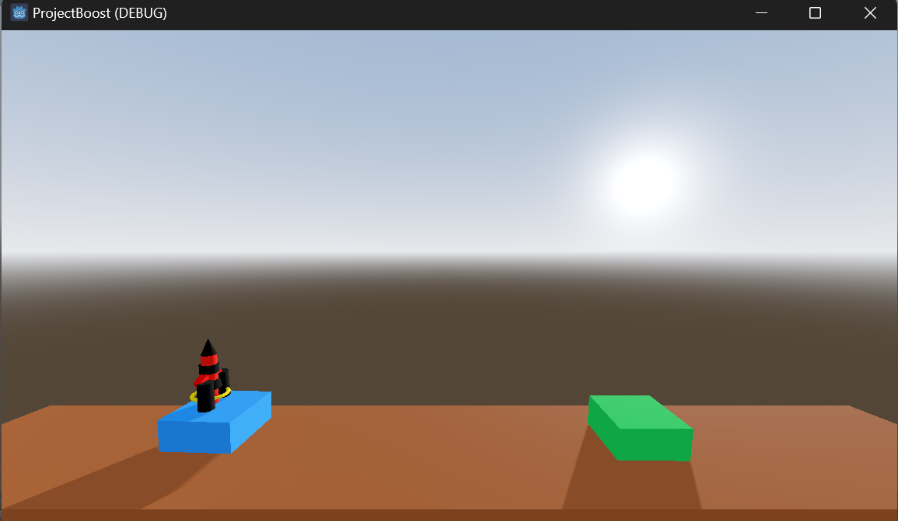
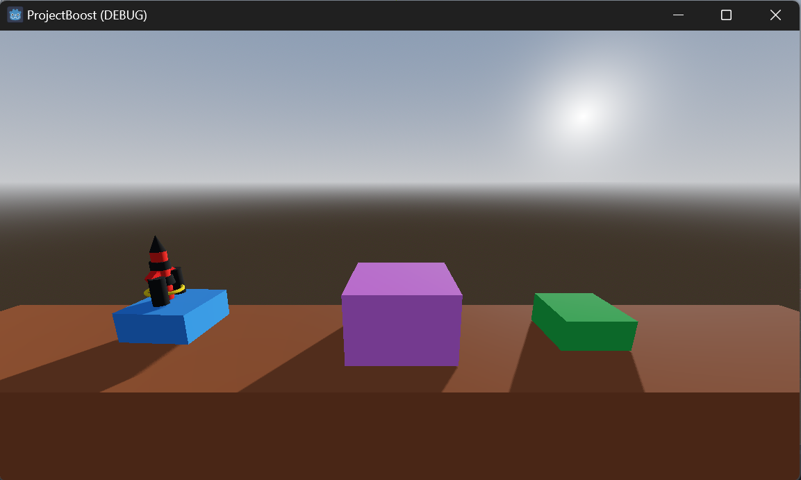
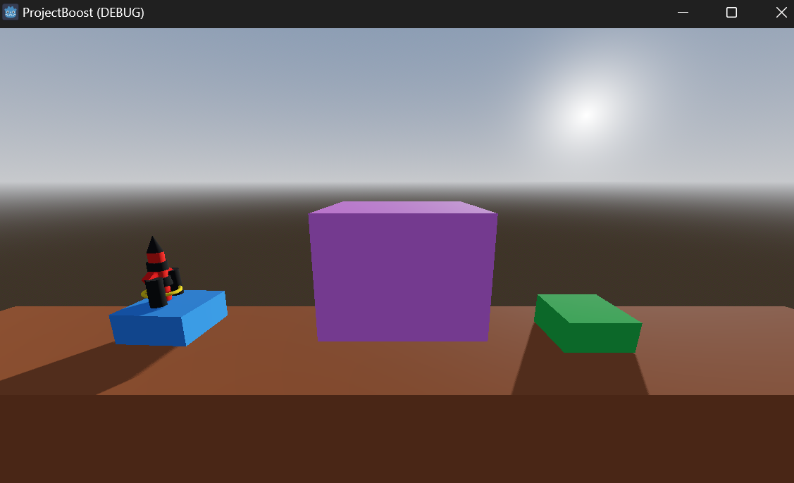
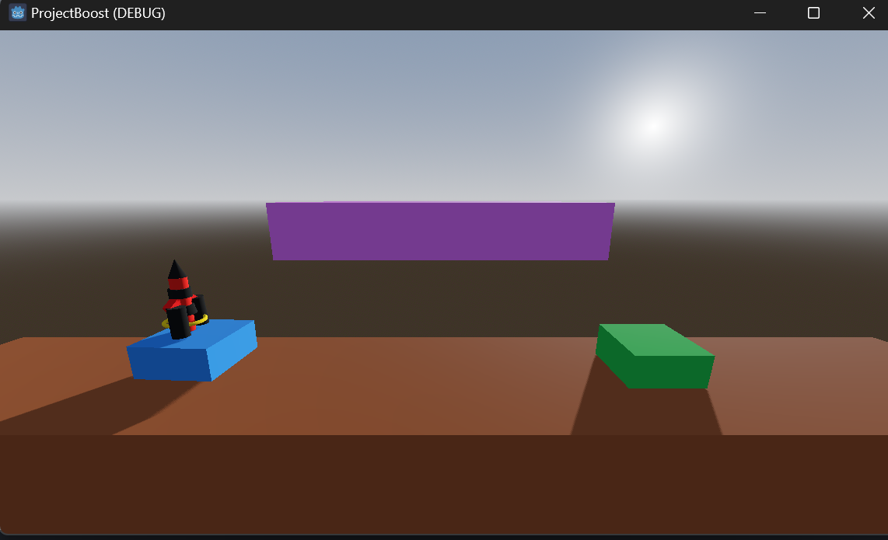
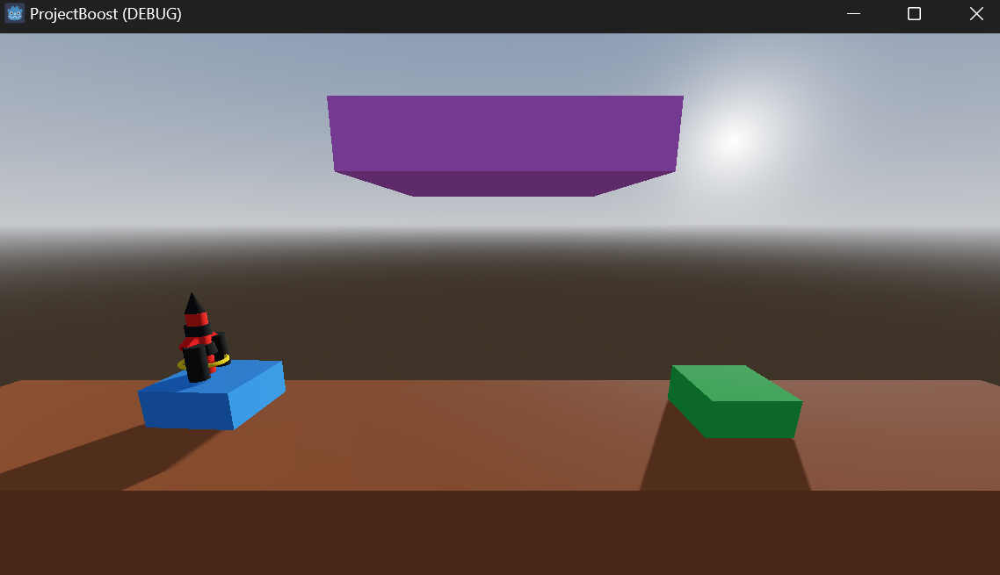
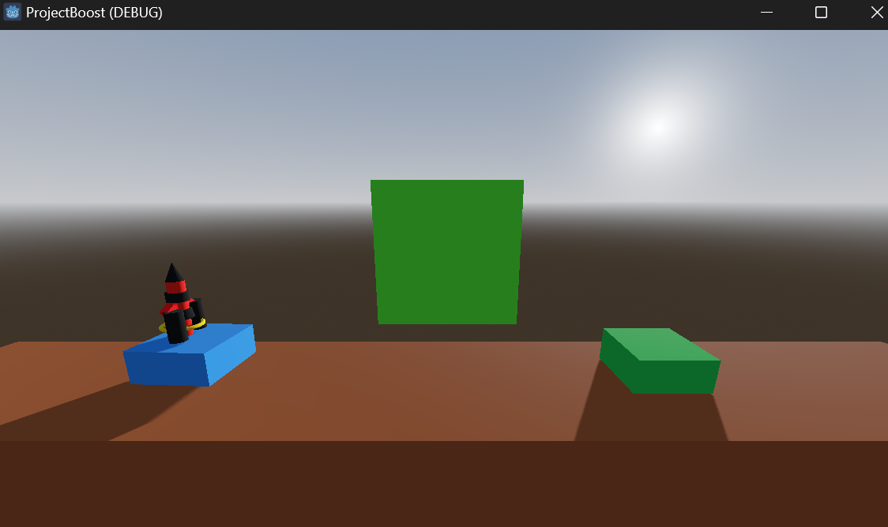

# ProjectBoost
'ProjectBoost' is my very first game, and it's really simple. In this game, you control a rocket through easy challenges. It's made for beginners and is all about enjoying the fun of making something basic but cool. Give it a try! 

## ProjectBoost: A 3D Godot Project from the ground up, controlling a rocket with physics to explore levels and avoid obstacles.

## Goal:Boost the rocket from the launching pad to the landing pad.Clear all six levels and you win!

## Controls : use the 'spacebar' to boost the rocket and the 'right arrow' key to direction it from launching pad to the landing pad.

## Screenshots

